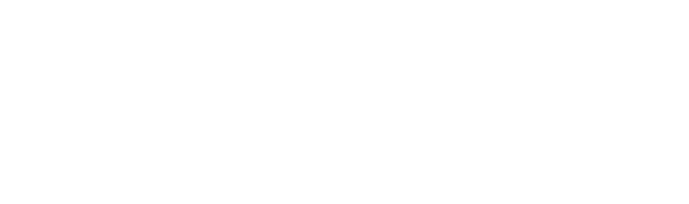

# Prism

<p align="center">
  
</p>

<p align="center">
  <strong>Studio automation for Roblox.</strong>
</p>

Prism is a Roblox Studio automation toolkit built on top of the ideas that made Rojo successful.

Rojo solved source synchronization, meanwhile Prism solves automation.

While inheriting Rojo's power of synchronizing files, Prism allows external tools to inspect and interact with a running Roblox Studio session through a local automation protocol.

---

## Current Features

### Remote execution

Execute trusted Luau directly inside Roblox Studio from your terminal.

```bash
prism exec script.lua
```

Example:

```lua
local part = Instance.new("Part")
part.Name = "PrismManual"
part.Parent = workspace

return part.Name
```

---

### Typed inspection

Inspect the live Studio DataModel without generating custom Luau.

```bash
prism inspect Workspace

prism inspect Workspace.Map

prism inspect Workspace.PrismManual --properties
```

Output:

```text
Workspace [Workspace]
  children:
    Terrain [Terrain]
    Rig [Model]
    SpawnLocation [SpawnLocation]
    Baseplate [Part]
```

Unlike `exec`, `inspect` is deterministic, typed, and intended for tooling.

---

### Studio plugin

Prism includes its own Studio plugin with:

- Prism branding
- local automation session
- remote execution
- typed automation handlers
- automatic plugin installation

---

## Philosophy

Prism is more an expansion on remote execution/inspection or a companion than a Rojo replacement.

Arbitrary execution is available through:

```bash
prism exec
```

Common operations should eventually become typed commands such as:

```bash
prism inspect
prism selection
prism camera
prism screenshot
```

Typed commands provide:

- deterministic output
- better validation
- stable APIs
- safer tooling
- improved AI integration

---

## Building

Requirements:

- Rust
- Cargo
- Roblox Studio

Build Prism:

```bash
cargo build --release
```

The executable will be:

```text
target/release/prism
```

---

## Installing the Studio plugin

```bash
prism plugin install
```

Restart Roblox Studio after installation.

---

## Serving a project

Inside a Rojo-compatible project:

```bash
prism serve
```

If multiple project files exist:

```bash
prism serve path/to/project.project.json
```

---

## Automation

Current automation commands:

```bash
prism exec script.lua

prism inspect Workspace
```

---

## Compatibility

Prism remains compatible with existing Rojo project files.

Compatibility-sensitive internal identifiers, routes, and project formats remain unchanged.

Examples include:

- `/api/rojo`
- Rojo project files
- existing synchronization protocol

This allows existing projects to continue working while adding Studio automation capabilities.

---

## Roadmap

The current release establishes the automation platform.

Planned capabilities include:

- Selection
- Camera
- Focus
- Search
- Screenshots
- Snapshot & Diff
- Preview Mode
- Watch
- Studio diagnostics
- Automated playtesting

---

## Status

Prism is currently in active development.

Current milestone:

**Prism 0.1**

Implemented:

- Studio automation protocol
- Remote execution
- Typed inspection
- Studio plugin
- A minor makeover of the Rojo UI
- Automatic plugin installation

---

## License

Prism is derived from Rojo.

Please refer to the repository license and retain all applicable attribution to the upstream Rojo project.
